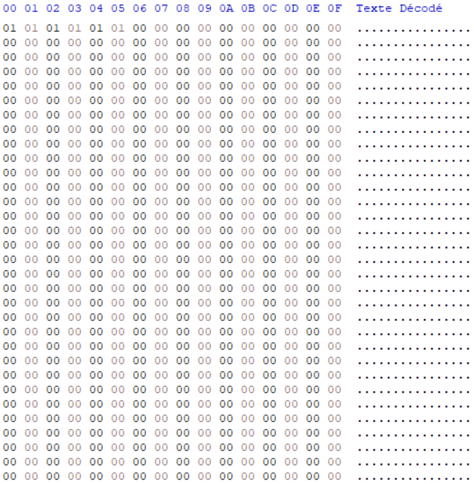
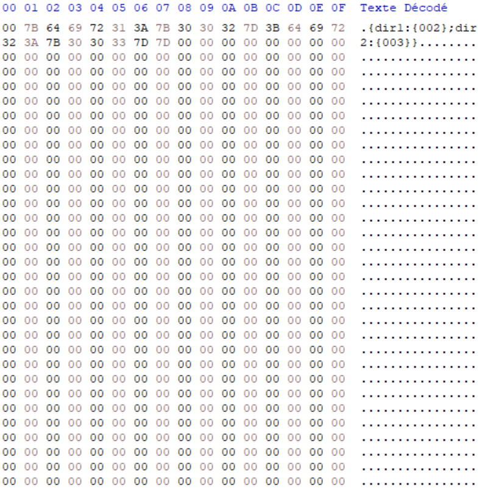
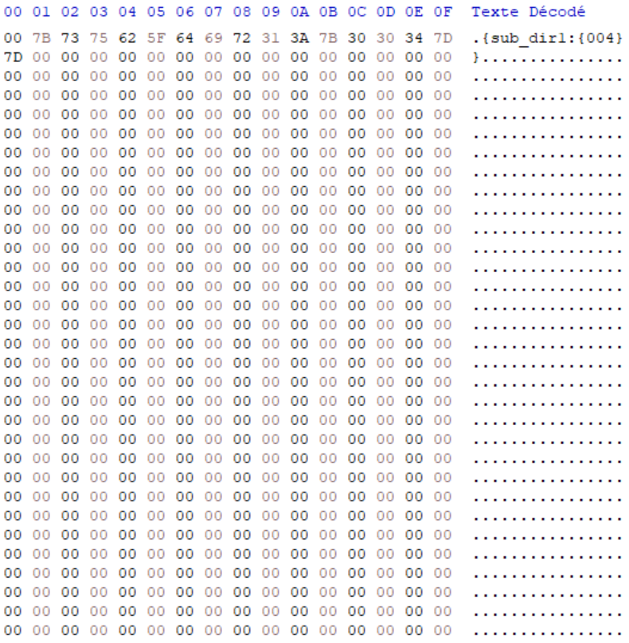
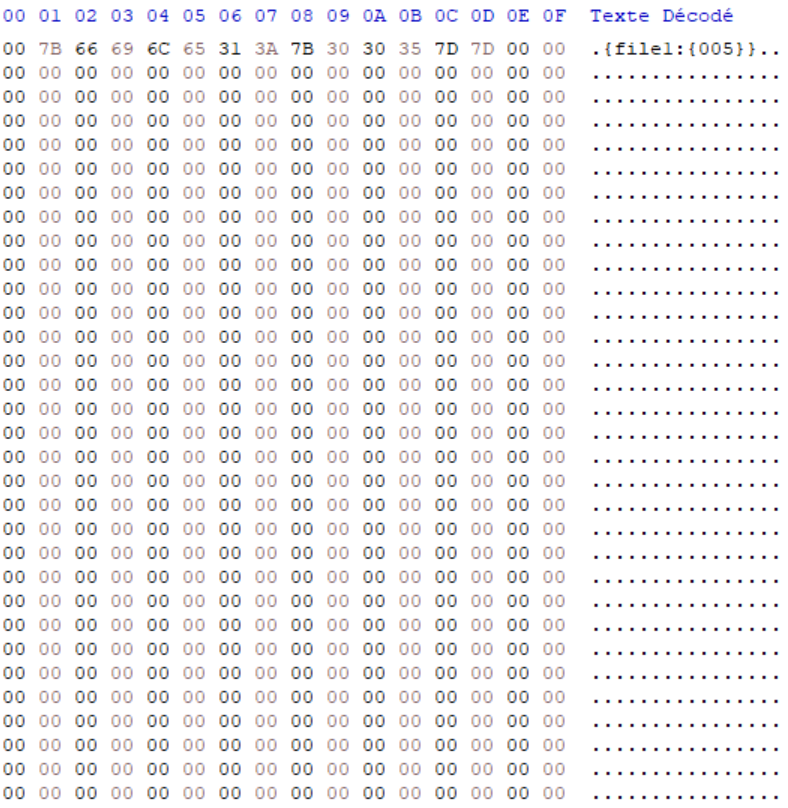
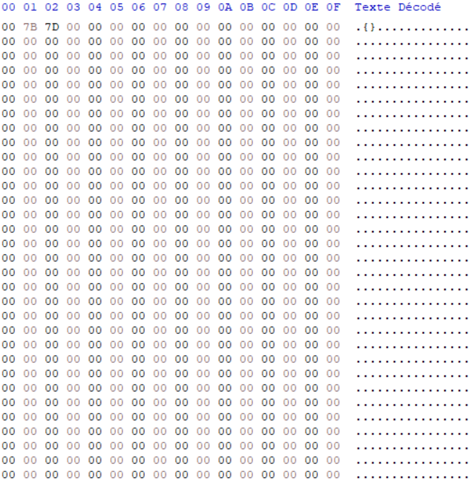
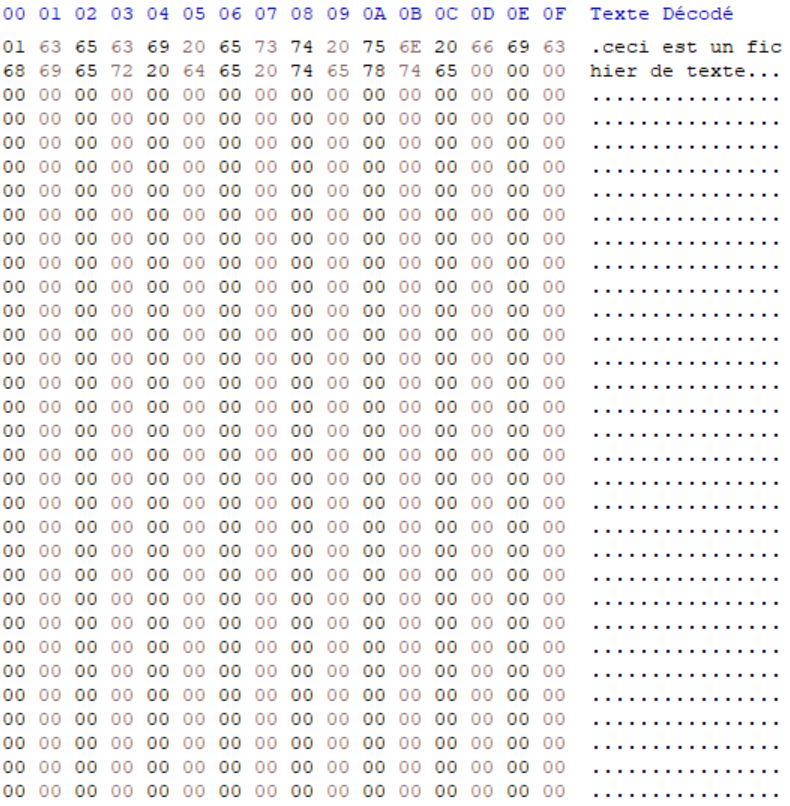

# exemple disk file :

The first block is a table where each byte represent a block. If the byte is 00, the corresponding block is free and if the byte is 01, the corresponding block is taken.

The second block is the root directory.

If the first bytes of each blocks is 00, the block is a dir, if the byte is 01, the block is a file.

the following exemple can be represent like that :

```
 /
 ├── dir1
 │   └── sub_dir1
 │       
 └── dir2
     └── file1
```

## bloc 0 :



## bloc 1 :



## bloc 2 :



## bloc 3 :



## bloc 4 :



## bloc 5 :


